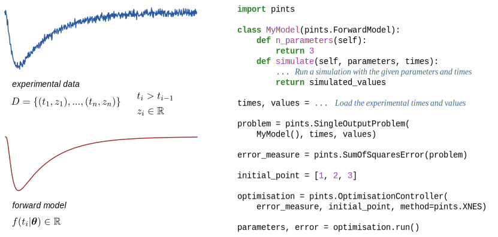

[](https://travis-ci.org/pints-team/pints)
[](https://ci.appveyor.com/project/MichaelClerx/pints/branch/master)
[](https://codecov.io/gh/pints-team/pints)
[](https://github.com/pints-team/functional-testing-results)
[](https://mybinder.org/v2/gh/pints-team/pints/master?filepath=examples)
[](http://pints.readthedocs.io/en/latest/?badge=latest)
[](https://bettercodehub.com/results/pints-team/pints)

# What is Pints?

Pints (Probabilistic Inference on Noisy Time-Series) is a framework for optimisation and Bayesian inference on ODE models of noisy time-series, such as arise in electrochemistry and cardiac electrophysiology.

## Using Pints

Pints can work with any model that implements the [pints.ForwardModel](http://pints.readthedocs.io/en/latest/core_classes_and_methods.html#forward-model) interface. 
This has just two methods:

```
n_parameters() --> Returns the dimension of the parameter space.

simulate(parameters, times) --> Returns a vector of model evaluations at
                                the given times, using the given parameters
```

Experimental data sets in Pints are defined simply as lists (or arrays) of `times` and corresponding experimental `values`.
If you have this kind of data, and if [your model (or model wrapper)](examples/writing-a-model.ipynb) implements the two methods above, then you are ready to start using Pints to infer parameter values using [optimisation](examples/optimisation-first-example.ipynb) or [sampling](examples/sampling-first-example.ipynb).

A brief example is shown below:  
  
_(Left)_ A noisy experimental time series and a computational forward model.
_(Right)_ Example code for an optimisation problem.
The full code can be [viewed here](examples/readme-example.ipynb) but a friendlier, more elaborate, introduction can be found on the [examples page](examples/README.md).

### Examples and documentation

Pints comes with a number of [detailed examples](examples/README.md), hosted here on github.
In addition, there is a [full API documentation](http://pints.readthedocs.io/en/latest/), hosted on readthedocs.io.

### Citing Pints

If you use PINTS in any scientific work, please [credit our work with a citation](./CITATION).


## Installing Pints

You'll need the following requirements:

- Python 2.7 or Python 3.4+
- Python libraries: `cma` `numpy` `matplotlib` `scipy`

These can easily be installed using `pip`. To do this, first make sure you have the latest version of pip installed:

```
$ pip install --upgrade pip
```

Then navigate to the path where you downloaded Pints to, and install both Pints and its dependencies by typing:

```
$ pip install .
```

Or, if you want to install Pints as a [developer](CONTRIBUTING.md), use

```
$ pip install -e .[dev,docs]
```

To uninstall again, type

```
$ pip uninstall pints
```

## Contributing to Pints

If you'd like to help us develop Pints by adding new methods, writing documentation, or fixing embarassing bugs, please have a look at these [guidelines](CONTRIBUTING.md) first.

## License

Pints is fully open source. For more information about its license, see [LICENSE](LICENSE.txt).

## Get in touch

Questions, suggestions, or bug reports? [Open an issue](https://github.com/pints-team/pints/issues) and let us know.

Alternatively, feel free to email us at `pints-core-devs at maillist.ox.ac.uk`.
